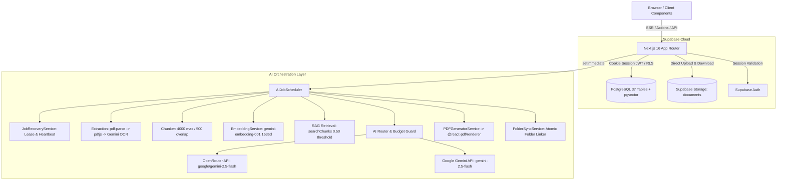
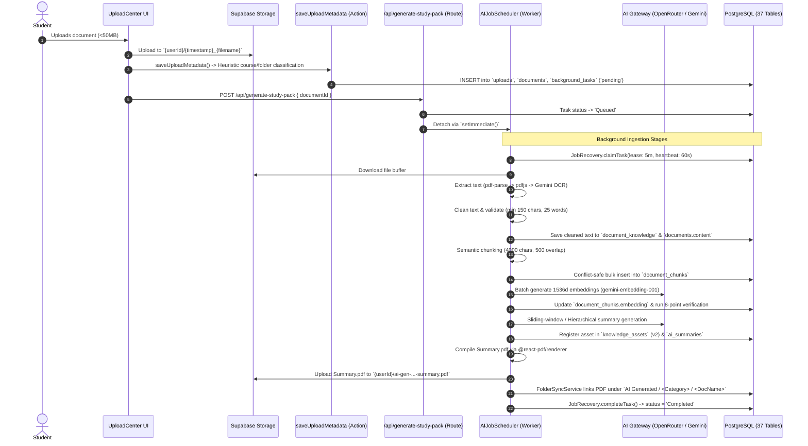
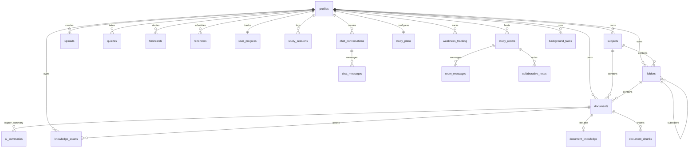

# NEURON OS — SYSTEM ARCHITECTURE & CODEBASE SPECIFICATION

> **System:** Neuron OS (AI-Powered Academic Operating System & Study Platform)  
> **Stack:** Next.js 16 (App Router) + React 19 + TypeScript + Tailwind CSS 4 + Supabase (PostgreSQL 15, Auth, Storage, pgvector) + OpenRouter / Gemini 2.5 Flash

---

## 1. System Overview & Core Capabilities

Neuron OS is an academic operating system for university students. It ingests course materials (PDF, DOCX, PPTX, TXT, Images), organizes them into hierarchical course/folder structures, builds a 1536-dimensional vector knowledge base, and generates personalized study assets (summaries, flashcards, MCQs, glossaries, revision key points, and study pack PDFs).

---

## 2. Technology Stack & Key Dependencies

| Component | Technology | Version | Key Files | Purpose |
| :--- | :--- | :--- | :--- | :--- |
| **Framework** | Next.js (App Router) | `16.2.6` | `src/app/**`, `src/proxy.ts` | SSR, Server Components, API routes, middleware |
| **Frontend** | React / Tailwind CSS | `19.2.4` / `4` | `src/components/**` | Windows 11 File Explorer UI, dashboard, rooms |
| **State** | Zustand | `5.0.14` | `src/store/*.ts` | Client state (explorer, settings, modals) |
| **Database** | Supabase PostgreSQL | `15+` | `supabase/migrations/*.sql` | 37 relational tables, RLS, pgvector, triggers |
| **Auth** | Supabase Auth (SSR) | `@supabase/ssr` | `src/lib/supabase/*.ts` | Cookie JWT sessions, middleware refresh, RLS-bound |
| **Storage** | Supabase Storage | `documents` | `src/actions/storage.ts` | Uploads (`{userId}/*`) and generated study pack PDFs |
| **AI Models** | Google Gemini / OpenRouter | Dual | `src/services/ai/**` | Gemini 2.5 Flash, OpenRouter failover, embeddings |
| **Extraction** | pdf-parse, pdfjs, Mammoth | Node libs | `src/services/ai/extractors/*`| Multi-tier fallback text extraction & OCR |
| **PDF Engine** | @react-pdf/renderer | `4.5.1` | `src/services/pdf/*` | Compiles Markdown AST to downloadable study PDFs |
| **Tokens** | js-tiktoken | `1.0.21` | `src/services/ai/pipeline/*` | Accurate context window budgeting |

---

## 3. High-Level Architecture

---

## 4. End-to-End Ingestion & Generation Lifecycle

---

## 5. Core AI Subsystems

### 1. Document Extraction Fallback Chain
- **PDF Strategy 1 (`pdf-parse`):** Fast stream extraction. Requires $\ge 150$ characters.
- **PDF Strategy 2 (`pdfjs-dist`):** Page-by-page token parser fallback.
- **PDF Strategy 3 (`Gemini Multimodal OCR`):** Base64 PDF prompt with anti-recitation copyright compliance.
- **DOCX / PPTX / Images:** Mammoth (`.docx`), OfficeParser (`.pptx`), Gemini Vision OCR (JPG/PNG/WEBP).
- **Validation Rules:** $\ge 150$ chars, $\ge 25$ words, $\ge 25\%$ alphanumeric ratio, no $>30$ repeated chars.

### 2. Chunking & Embeddings
- **Chunker (`chunkText`):** Bounded at 4,000 characters with 500 characters overlap along structural boundaries (headings, lists, paragraph breaks).
- **Embeddings (`getEmbeddings`):** Model `gemini-embedding-001`, batch size 50, output dimensionality `1536` for vector compatibility.
- **Vector Storage:** Stored in `document_chunks.embedding vector(1536)` indexed via HNSW cosine distance (`vector_cosine_ops`).

### 3. RAG Retrieval Engine (`searchChunks` & `retrieveKnowledge`)
- **Scoping:** Strictly queries active, non-deleted documents in `Knowledge Ready` stage for calling `userId`.
- **Zero-Hallucination Guard:** Minimum similarity threshold `0.50`. If nothing matches, returns empty context.
- **Diversity Selection:** 2-pass selection prioritizing non-adjacent chunk indices ($|idx_1 - idx_2| > 1$) to prevent localized duplicate context.
- **Confidence Rating:** $\ge 0.90$ (Excellent), $\ge 0.75$ (Good), $\ge 0.50$ (Weak), $< 0.50$ (No Match).

### 4. AI Gateway & Cost Guard (`routeAIRequest`)
- **Multi-Provider Failover:** Primary OpenRouter (`google/gemini-2.5-flash`) $\leftrightarrow$ Fallback Google Gemini SDK (`gemini-2.5-flash`). Circuit breaker trips after 3 consecutive failures.
- **Budget Guard:** Restricts output token ceilings (default 4096) to prevent 402 billing runaways.
- **Semantic Caching:** Hashes query embeddings against `semantic_cache` ($\ge 0.88$ match threshold, 7-day TTL).

### 5. Universal AI Versioning Manifest (`ai-version-manifest.ts`)
- **Global Flag:** `AI_GENERATION_VERSION = 2`.
- Stored on `knowledge_assets.generation_version`. If a prompt or renderer is upgraded, incrementing this single integer automatically invalidates old assets and forces regeneration on demand.

---

## 6. Background Task Engine & Crash Recovery

- **Queue Tables:** `background_tasks` and `asset_generation_jobs`.
- **Worker Identity:** `study-pack-worker:{timestamp}:{rand}`.
- **Lease Lock:** 5-minute duration (`JOB_LEASE_DURATION_MS = 300000`).
- **Heartbeat:** 60-second interval updating `heartbeat_at` and extending `lock_expires_at`.
- **Crash Recovery Watchdog (`recoverStaleJobs`):** Discovers tasks in progress with expired leases. If `attempts < 3`, re-queues them to `Queued`; if $\ge 3$, marks them `Failed`.
- **Concurrency & Idempotency:** DB unique constraints on `(user_id, document_id, task_type)` and `(document_id, chunk_index)` prevent duplicate worker conflicts.

---

## 7. Database Schema & Data Models (37 Tables)

### Key Table Groups
1. **Core Workspace:** `profiles`, `subjects`, `folders`, `uploads`, `documents`, `document_chunks`, `document_knowledge`, `shared_notes`.
2. **AI Knowledge Assets & Tasks:** `knowledge_assets` (v2 store), `asset_generation_jobs`, `background_tasks`, `ai_summaries`, `semantic_cache`.
3. **Study & Assessment:** `quizzes`, `flashcards`, `reminders`, `concept_evaluations`, `weakness_tracking`, `exam_readiness`, `study_plans`, `productivity_insights`.
4. **Gamification & Engagement:** `user_progress` (XP, levels, streaks), `achievements`, `user_achievements`, `study_sessions`, `leaderboard_seasons`, `monthly_champions`.
5. **Real-time Collaboration:** `study_rooms`, `room_members`, `room_messages`, `collaborative_notes`, `room_quizzes`, `room_quiz_attempts`, `room_analytics`, `ai_meeting_summaries`.
6. **Chat Assistant:** `chat_conversations`, `chat_messages`.

---

## 8. Security, Auth & Data Isolation

- **Row Level Security (RLS):** Enabled on all 37 database tables. Every query is scoped to `auth.uid() = user_id` (or shared room/document permissions).
- **No Service Role Bypass:** Application code uses exclusively `NEXT_PUBLIC_SUPABASE_ANON_KEY` bound to session JWT cookies via `@supabase/ssr`.
- **Storage Partitioning:** User files are restricted to path prefix `{userId}/*`.

---

## 9. Complete API Routes & Server Actions Summary

### API Routes (`src/app/api/**`)
- `POST /api/generate-study-pack`: Dispatches background `AIJobScheduler` worker pipeline.
- `POST /api/assistant/chat`: Multi-turn RAG chat with tool calling (`searchDocumentContent`, `listDocuments`, etc.).
- `POST /api/summarize`: On-demand lecture summary generator.
- `POST /api/key-points`: Generates structured JSON key points.
- `POST /api/definitions`: Generates structured glossary definitions.
- `POST /api/examples`: Generates categorized real-world/exam examples.
- `GET /api/asset-manager/[documentId]`: Fetches asset generation state map.
- `GET /api/knowledge-assets/[documentId]`: Fetches versioned study assets.
- `POST /api/process-document`: Legacy extraction endpoint.
- `GET /api/debug-status`: Database and task status diagnostic.
- `GET /auth/callback`: Supabase OAuth / PKCE session exchange.

### Server Actions (`src/actions/**`)
- **`uploads.ts`:** `saveUploadMetadata`, `deleteUpload`, `createFileAction`, `saveFileAction`, `confirmAIClassification`.
- **`folders.ts`:** `createFolderAction`, `scaffoldSubjectFoldersAction`, `renameFolderAction`, `deleteFolderAction`, `moveFolderAction`, `moveDocumentAction`.
- **`subjects.ts`:** `createSubject`, `renameSubject`, `moveToRecycleBin`, `deleteSubjectPermanently`.
- **`study-coach.ts`:** `evaluateConceptAction`, `saveStudyPlanAction`, `getAcademicHealthAction`, `getExamReadinessAction`, `getProductivityInsightsAction`.
- **`study-rooms.ts`:** `createStudyRoomAction`, `joinStudyRoomAction`, `sendRoomMessageAction`, `saveWhiteboardDataAction`, `hostRoomQuizAction`.
- **`gamification.ts`:** `dailyCheckIn`, `logStudySession`, `completeQuickQuiz`, `shareMaterials`.
- **`auth.ts`:** `signUpAndOnboard`, `signInWithEmail`, `signOutUser`, `deleteUserAccountAction`, `validateUsername`.
- **`quiz.ts`:** `generateQuizAction`, `submitQuizAction`.

---

## 10. Key Architecture & Scalability Observations

1. **Background Task Serverless Limitation (CRITICAL):**
   - Background tasks run detached via Node.js `setImmediate()` inside Next.js route handlers.
   - On serverless platforms (Vercel / Lambda), HTTP response termination freezes the container, causing long tasks (extraction, embedding, summary) to halt mid-execution.
   - *Target Fix for Scale:* Transition background jobs to a decoupled worker or queue (e.g. BullMQ, Redis, Cloud Tasks, or containerized worker).
2. **Database Count Queries at Scale (HIGH):**
   - Dashboard executes `count: 'exact'` across 5 tables simultaneously. As tables grow into millions of records, table scans will increase TTFB latency.
3. **In-Memory Cosine Fallback (HIGH):**
   - If PostgreSQL vector RPC fails, vector search falls back to loading all user chunks into Node.js heap memory to compute cosine similarity in JS.
4. **Hardcoded Windows Logging Paths (MEDIUM):**
   - Diagnostic file appends write to `d:/FYP Project/neuron/background_logs.txt`. On Linux containers, this must be made environment-aware or routed to standard stdout/APM.

---
