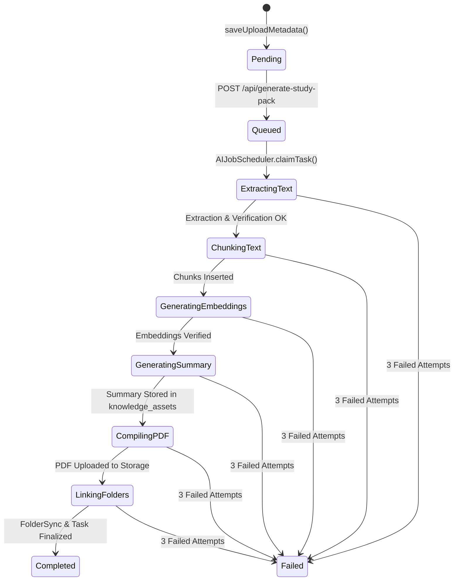

# NEURON OS — PHASE 1 ARCHITECTURE AUDIT
## Current Background Processing & Worker Lifecycles

> **Document Type:** Phase 1 Forensic Pre-Implementation Audit  
> **Document Purpose:** Complete analysis of asynchronous workloads, serverless execution vulnerabilities, and background job lifecycles across Neuron OS prior to queue decoupled modernization.

---

## 1. Current Ingestion & Background Flow

In the current codebase, document processing flows through an in-process detached event loop pattern:

```text
User Drops File in UploadCenter UI
                ↓
Supabase Storage Upload: Direct client upload to 'documents' bucket
                ↓
saveUploadMetadata() Server Action:
- Classifies course/folder via heuristic keywords
- Inserts row into `uploads` table
- Inserts row into `documents` table (summary_status: 'none')
- Inserts row into `background_tasks` table (status: 'pending')
                ↓
POST /api/generate-study-pack:
- Validates user auth session via `@supabase/ssr` cookies
- Verifies document ownership & subject assignment
- Runs JobRecoveryService.recoverStaleJobs()
- Updates `background_tasks.status = 'Queued'`
- Captures accessToken & refreshToken
- Calls setImmediate(runScheduler)
- Returns HTTP 200 { success: true, taskId } in ~150ms
                ↓
Detached Event Loop Worker (runScheduler inside Next.js node process):
- Creates anon Supabase client & calls setSession(accessToken, refreshToken)
- Instantiates AIJobScheduler(supabase, documentId, userId, taskId, options)
- Claims task lease (5 min) & starts 60s heartbeat timer
- Stage 1 (Extraction): pdf-parse -> pdfjs-dist -> Gemini OCR -> Clean & Validate -> `document_knowledge`
- Stage 2 (Chunking): 4000 max / 500 overlap -> `document_chunks`
- Stage 3 (Embeddings): gemini-embedding-001 (1536d batch) -> `document_chunks.embedding`
- Stage 4 (Summary): SlidingWindowSummarizer -> OpenRouter google/gemini-2.5-flash -> `knowledge_assets` (v2) & `ai_summaries`
- Stage 5 (PDF Compile): @react-pdf/renderer -> Summary.pdf buffer
- Stage 6 (Storage Upload): Uploads Summary.pdf to `{userId}/ai-gen-...-summary.pdf`
- Stage 7 (Folder Sync): FolderSyncService links Summary.pdf under `AI Generated / Category / DocName`
- Completes task -> updates `background_tasks.status = 'Completed'`
```

---

## 2. Inventory of Every Background & Asynchronous Workload

| Job / Workload | Trigger Mechanism | Current Execution Mechanism | Typical Duration | Database State Updates | Retry Mechanism | Idempotency Safeguards | AI Gateway Usage |
| :--- | :--- | :--- | :---: | :--- | :--- | :--- | :--- |
| **Study Pack Generation** | `POST /api/generate-study-pack` (Auto or UI dialog) | `setImmediate(runScheduler)` inside Next.js route | 45s – 180s | `background_tasks`, `documents`, `document_knowledge`, `document_chunks`, `knowledge_assets`, `ai_summaries` | 3 attempts via `JobRecoveryService` watchdog | `uq_background_tasks_user_document_type`, `idx_documents_unique_folder_title` | OpenRouter (Primary) $\rightarrow$ Gemini (Fallback) |
| **Legacy Document Extraction** | `POST /api/process-document` (Legacy endpoint) | `setImmediate(backgroundExtractionTask)` | 30s – 90s | `documents`, `document_knowledge`, `document_chunks`, `flashcards` | None (Single attempt) | None | Direct Gemini Multimodal OCR |
| **On-Demand Summary** | `POST /api/summarize` | Synchronous HTTP Request | 15s – 35s | `knowledge_assets`, `ai_summaries` | Client retry | Semantic cache ($\ge 0.88$) & asset check | OpenRouter $\rightarrow$ Gemini |
| **On-Demand Key Points** | `POST /api/key-points` | Synchronous HTTP Request | 8s – 18s | `knowledge_assets` | Client retry | Versioned asset check | OpenRouter $\rightarrow$ Gemini |
| **On-Demand Definitions**| `POST /api/definitions` | Synchronous HTTP Request | 8s – 20s | `knowledge_assets` | Client retry | Versioned asset check | OpenRouter $\rightarrow$ Gemini |
| **On-Demand Examples** | `POST /api/examples` | Synchronous HTTP Request | 8s – 20s | `knowledge_assets` | Client retry | Versioned asset check | OpenRouter $\rightarrow$ Gemini |
| **Assessment Quiz Gen** | `generateQuizAction` Server Action | Synchronous Server Action | 10s – 25s | `quizzes` | Single internal retry on JSON parse failure | None | Direct Gemini SDK (`getAIClient`) |
| **Viva Concept Grader** | `evaluateConceptAction` Server Action | Synchronous Server Action | 5s – 12s | `concept_evaluations`, `weakness_tracking` | Single retry | None | Direct Gemini SDK (`getAIClient`) |
| **Meeting Minutes Gen** | `hostRoomQuizAction` / Room leave | Synchronous Server Action | 10s – 20s | `ai_meeting_summaries` | Single retry | None | Direct Gemini SDK (`getAIClient`) |

---

## 3. Forensic Identification of Serverless Risks

### Risk 1: `setImmediate()` in Next.js Route Handler
- **Location:** [`src/app/api/generate-study-pack/route.ts:246`](file:///d:/FYP%20Project/neuron/src/app/api/generate-study-pack/route.ts#L246)
- **Code:**
  ```typescript
  // Use setImmediate to execute on next event loop tick after HTTP response is flushed
  setImmediate(runScheduler);
  ```
- **Vulnerability:** On serverless platforms (Vercel, AWS Lambda, Cloudflare Pages), the execution runtime terminates the CPU slice as soon as `NextResponse.json(...)` finishes sending to the client. The detached `runScheduler` promise is frozen mid-execution. As a result, documents become indefinitely stuck in `Extracting Text` or `Generating Summary` until the 5-minute lease expires and a watchdog re-queues them.

### Risk 2: Legacy In-Process Background Task
- **Location:** [`src/app/api/process-document/route.ts:639`](file:///d:/FYP%20Project/neuron/src/app/api/process-document/route.ts#L639)
- **Code:**
  ```typescript
  setImmediate(backgroundExtractionTask);
  ```
- **Vulnerability:** Dead legacy code duplicating extraction logic that also relies on detached serverless execution.

### Risk 3: Synchronous Long-Running AI Generation in HTTP Routes
- **Locations:** `/api/summarize`, `/api/key-points`, `/api/definitions`, `/api/examples`, `generateQuizAction`.
- **Vulnerability:** HTTP requests lasting 20–40s risk client-side gateway timeouts (504 Gateway Timeout) on mobile and slow networks.

---

## 4. Current State Transition Matrix



---
