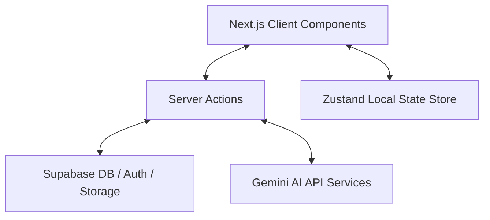

# Neuron OS — System Architecture

Neuron OS is an AI-powered academic operating system built using Next.js (App Router), Supabase (Auth, Database, Storage), and Google Gemini AI API.

## High-Level Architecture Diagram

## Core Directories Structure

- `src/app/`: File-system routes, layout definitions, and API route handlers.
- `src/actions/`: Centralized Next.js Server Actions handling Supabase DB interactions.
- `src/services/`: Pure business logic and third-party integrations (AI models, gamification rules).
- `src/providers/`: Global UI wrappers (theme context).
- `src/store/`: Client-side state stores managed using Zustand.
- `src/types/`: Centralized TypeScript interfaces.
- `src/constants/`: Shared static configurations, routes, and limits.
- `src/config/`: Environment configuration wrappers.
