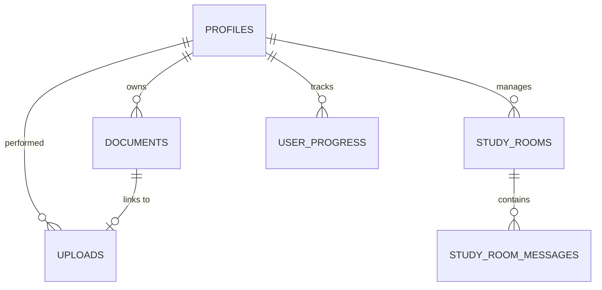

# Database Schema Guide

Neuron OS uses Supabase (PostgreSQL) under the hood. The database features RLS (Row Level Security) policies to ensure data privacy and user separation.

## Tables and Schema

### 1. `profiles`
Stores student profile metadata, including majors, semesters, and gamification streaks.
- `id` (uuid, primary key, references auth.users)
- `first_name` (text)
- `last_name` (text)
- `full_name` (text)
- `username` (text, unique)
- `email` (text)
- `bio` (text)
- `university` (text)
- `degree_program` (text)
- `semester` (text)
- `profile_image` (text)
- `interests` (text[])
- `study_goals` (text[])
- `country` (text)
- `timezone` (text)

### 2. `documents`
Represents uploaded academic PDF/doc/txt study materials.
- `id` (uuid, primary key)
- `user_id` (uuid, references profiles.id)
- `title` (text)
- `file_url` (text)
- `file_type` (text)
- `summary_status` (text)
- `quiz_status` (text)
- `ai_subject` (text)
- `ai_topic` (text)

### 3. `user_progress`
Tracks student level, total accumulated XP, and streak metrics.
- `user_id` (uuid, primary key, references profiles.id)
- `total_xp` (integer)
- `current_level` (integer)
- `current_streak` (integer)
- `highest_streak` (integer)
- `last_active_date` (date)
